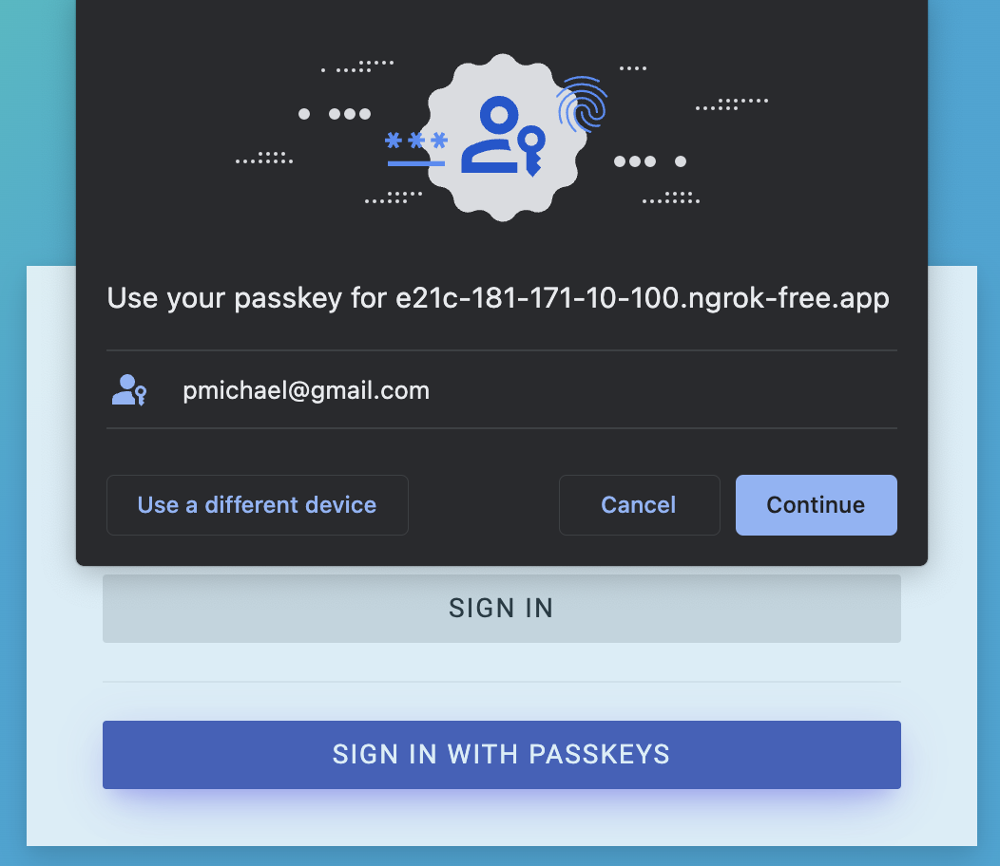
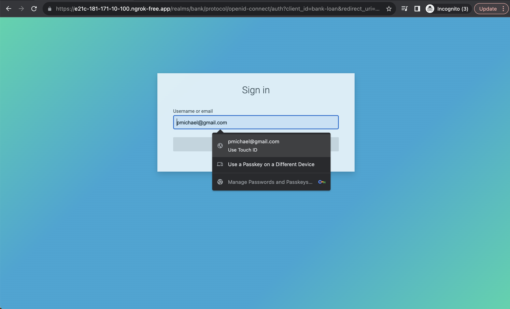
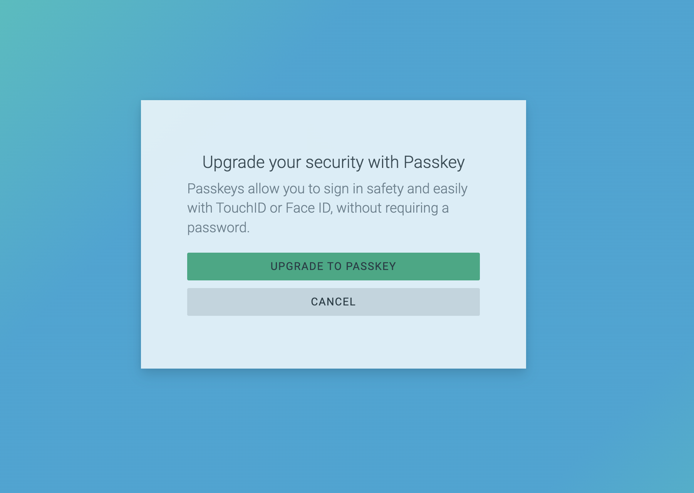
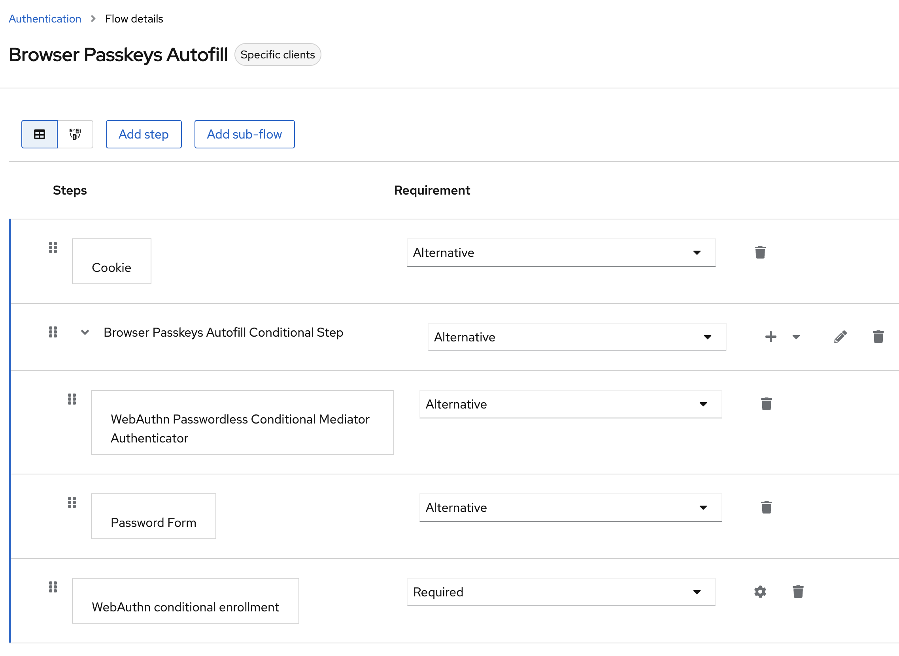
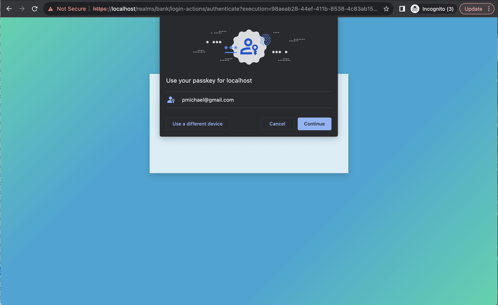
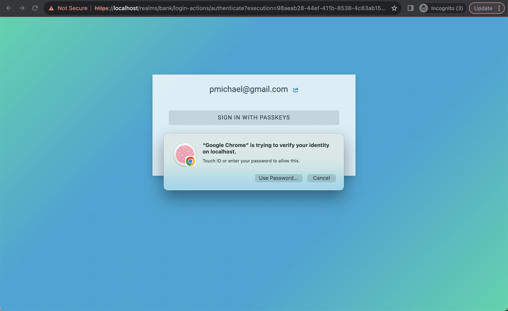
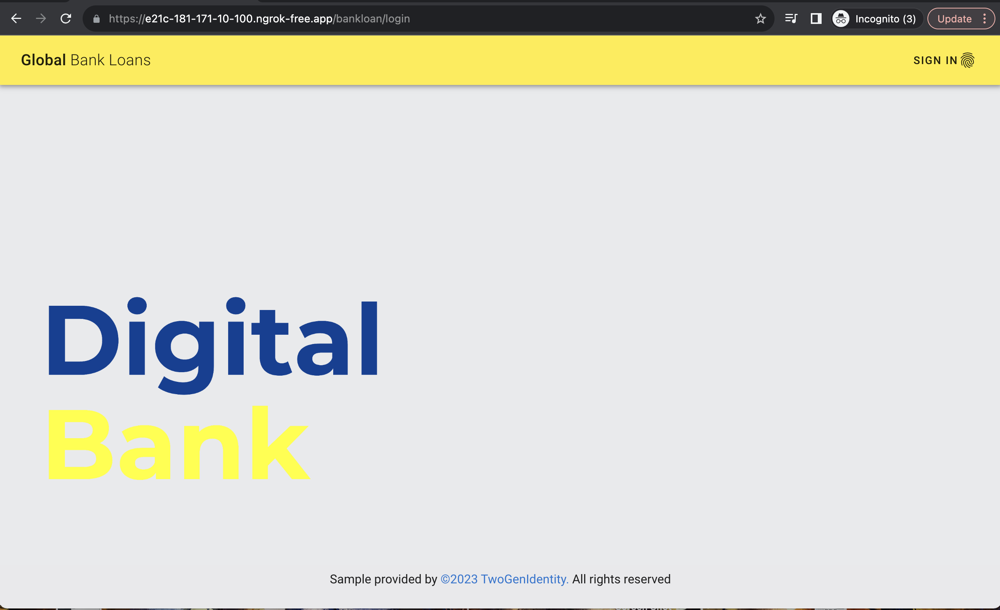
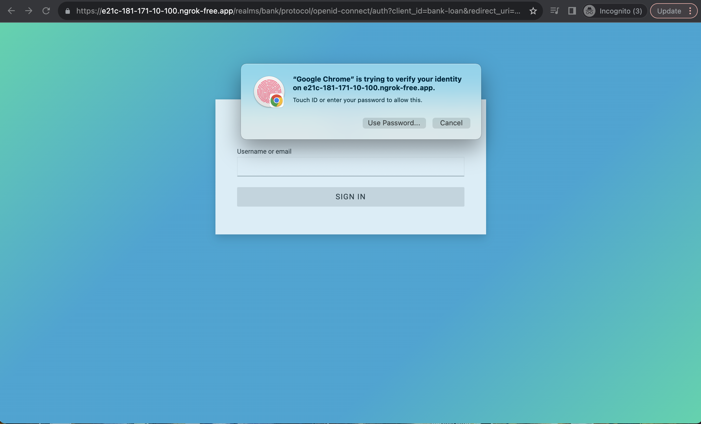
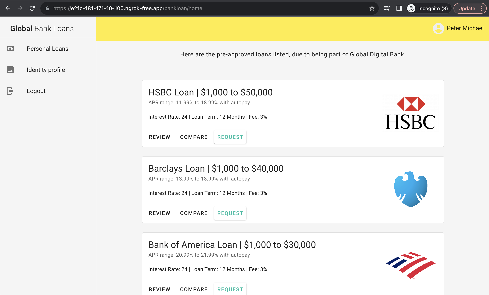

# Keycloak Workshop for Step Up with MFA Biometrics Authentication (Passkeys) and Passwordless login with Passkey autofill

This repository contains a PoC implemented with [Keycloak](https://www.keycloak.org/) on demostrating how to apply Step Up for Web Apps and APIs with Biometrics Authentication, in this case, [Passkeys](https://fidoalliance.org/passkeys). It also outlines the process of transitioning to a **passwordless** experience through the use of Passkeys.
It doesn’t matter whether your current application utilizes authentication via username and password. I will demonstrate how you can also provide Passkey login, offering a remarkably smooth experience through [WebAuth Conditional UI](https://github.com/w3c/webauthn/wiki/Explainer:-WebAuthn-Conditional-UI) or Passkey autofill during the transition to a passwordless login.

Based on [FIDO Alliance](https://fidoalliance.org) and W3C standards, Passkeys replace passwords with cryptographic key pairs. Passkeys are: Strong credentials, Safe from server leaks and Safe from phishing.

The PoC also shows how to implement **OAuth 2.0 Step-up Authentication** based on [OAuth 2.0 Step-up Authentication Challenge Protocol](https://datatracker.ietf.org/doc/draft-ietf-oauth-step-up-authn-challenge/). This gives the possibility to the API to implement step-up authentication thanks to understand the required Authentication Context Level (acr) and then, if the level is not enough, tells to the client that it needs to trigger step-up authentication. This improves the user experience as you can see in the demo.

You will find more details in the following article:
- https://embesozzi.medium.com/keycloak-workshop-for-step-up-with-mfa-biometrics-authentication-passkeys-b7020ea9ae1b
## In Short

### Step-up + MFA with Biometric Authentication (Passkeys)
The PoC implements the concept of step-up authentication for web apps and APIs detailed in my previous [article](https://embesozzi.medium.com/keycloak-step-up-authentication-for-web-and-api-3ef4c9f25d42). Therefore, go there if you need more details about it.

Nevertheless, I've added to the **Global Bank** portal the feature for handling the step-up on the API side following the [OAuth 2.0 Step-up Authentication Challenge Protocol](https://datatracker.ietf.org/doc/draft-ietf-oauth-step-up-authn-challenge/) proposed standard requiring MFA with Biometrics. So, the OAuth Spring **Bank Account API** will return 401 Unauthorized with 'WWW-Authenticate' header with 'insufficient_authentication_level' error message and the defined 'acr_values' that indicates to the client application what acr value to request at the identity provider. On the client side, the Bank Portal is able to interpred this error and redirect to the user to do the step-up authentication - with a lovely modal explaning the situation.

### Passworless experience with Passkey autofill
When moving from passwords to passkeys, there might be challenges. User experience matters a lot. The default “modal” experience might not be good in some cases. But using the passkey with autofill (WebAuth Conditional UI) feature can improve the login process. Currently, Keycloak doesn’t have this feature, but I’ve made a custom SPI authenticator called [keycloak-webauthn-conditional-mediation](https://github.com/embesozzi/keycloak-webauthn-conditional-mediation) to add it.

Here's the default  user experience when trying to login with Passkeys, which is a dialog that pops up. In some cases the UX is not good.
- Default user experience with Passkeys   


By using the feature called conditional UI (a part of the WebAuthn standard), you can enhance the UX. You can include passkeys in autofill suggestions.
- Improved Passkeys with suggestions   

    
When the user taps on the username input, an autofill suggestion dialog appears with stored passkeys, in addition to password autofil. The user can then select an account and use the device screen lock to sign in.

In the workshop, the application named **Bank Loan** portal will utilize this approach to enhance the overall passwordless experience through the use of **Passkeys** with autofill.

### Webauthn Authenticator Conditional enrollment

In the latest version of the workshop, we added the feature of allowing the user to decide when they want to register the WebAuthn authenticator with the custom SPI (WebAuthn Authenticator Conditional Enrollment), either during the sign-up or sign-in process.

If the user doesn't have any passkey registered, it will be a common scenario when transitioning from a password-based to a passwordless experience. The sign-in process will ask the user if they want to upgrade to a passkey.

Therefore, you will follow the step below:   




## Overview Architecture

* Keycloak is responsible for handling the authentication with the standard OpenID Connect.

* The **Global Bank** Portal is an SPA integrated with Keycloak using OpenID Connect. The Portal is capable of handling the 401 Unauthorized with **WWW-Authenticate** header, based on this [standard](https://datatracker.ietf.org/doc/draft-ietf-oauth-step-up-authn-challenge/) to perform doing the step-up authentication.

* The **Bank Account API** is a Spring Boot protected by OAuth 2.0, acting as [OAuth2 Resource Server](https://docs.spring.io/spring-security/site/docs/current/reference/html5/#oauth2resourceserver). The API follows the [standard](https://datatracker.ietf.org/doc/draft-ietf-oauth-step-up-authn-challenge/) to trigger the step-up authentication challenge if the presented access token offers insufficient authentication based on the acr claim.

* The **Bank Loan** Portal is a Vue application integrated with Keycloak using OpenID Connect. The Portal is authenticated with Keycloak, providing a passwordless experience with Passkeys.

 

* The custom SPI **Webauthn Passwordless Conditional Mediation Authenticator** (the repository will be available shortly) supports the following features:
    - Enabling passkey autofill when supported by the browser.
    - Displaying the “Sign with passkeys” button if passkey autofill is not available.
    - If Passkeys (Webauthn) are not supported, it will present the traditional username and password login option.

* Here is the Passkeys Autofill flow :
    

You can see we added the WebAuthn Conditional Enrollment step, which will help by asking the user if they want to move to a passwordless experience with a Passkey. The user will be asked if they don't have any passkey registered.

# How to install?
## Prerequisites

 * Install Git, [Docker](https://www.docker.com/get-docker) and [Docker Compose](https://docs.docker.com/compose/install/#install-compose) in order to run the steps provided in the next section<br>

## Deploy the PoC

1. Clone this repository
    ````bash
    git clone https://github.com/embesozzi/keycloak-workshop-stepup-mfa-biometrics
    cd keycloak-workshop-stepup-mfa-biometrics
    ````

2. Execute following Docker Compose command to start the deployment

   ```sh
   docker-compose -f docker-compose-idp.yml -f docker-compose-apps.yml -f docker-compose-lb.yml up
   ```

3. Access the following URLs below exposed through the NGINX container via a web browser..

| Component                 | URI                        | Username | Password  | Authn or Authz reference|
| ------------------------- | -------------------------- | -------- | --------- | --------- |
| Global Bank Portal        | https://public-url/bank     |          |           | pwd (1F) or pwd + passkeys (MFA) |
| Bank Account API Portal   | https://public-url/api      |          |           | OAuth 2.0 ACR claim loa2  |
| Bank Loan Portal          | https://public-url/bankloan |          |           | passkeys autofill (1F) or pwd |
| Keycloak Console          | https://localhost          | admin    | password  |


4. Expose the application with a valid certificate, you can use ngrok for testing the passwordless experience. Just run the following command:

    ```bash
    docker run -it -e NGROK_AUTHTOKEN={YOUR-TOKEN} \
        ngrok/ngrok:alpine http host.docker.internal:443
    ```

> **Considerations**:   
> Check out the [Passkeys Browser Autofill UI Device Support link](https://passkeys.dev/device-support/). So far, Ubuntu doesnt not support Passkey Autofill UI.   
>   
   
## Test cases
As an example, I've implemented **Global Bank portal** (Cases 1 and 2) portal that has the following requirements:

* Supports OIDC login with one-factor username and password and two factor with Passkeys
* Only authenticated user with MFA Passkeys can access to manage the bank accounts
* If the user is not authenticated with MFA when managing bank accounts, it triggers the step-up to MFA :) in a lovely way

The **Bank Loan portal** (Case 3) has the following requirements:
* Supports OIDC login with Passkeys → A super nice way to do the login with Passkeys autofill
* Only authenticated users can view and apply for the loans

### Use case 1: Sign up on the Global Bank Portal

1.1. Access to the [Bank Portal](https://localhost/bank) and proceed with user registration:
    
    
1.2. Complete the user information (step 1):   
     

1.5. Click in Upgrade to Passkey button:
You can do it during the sign-up or sign-in process.   


1.4. Register the Passkeys (step 2):  
    
    

1.5. You will see the Bank Portal Home  
    

### Use case 2: Sign in to the Global Bank Portal for Managing Bank Accounts

2.1. Access to the [Bank Portal](https://localhost/bank) and Sign In:  
    

2.2 Complete the username and password (1 factor):  
    
      
2.3 You will see to the Bank Portal Home:  
       

2.4 Go to the Identity Profile section and check your ACR claim: **loa1**   
     

2.5 Go to the Manage Bank Accounts. You will see that Authn Level is not enough, with a lovely modal that handles the step-up authentication based on the access denied information.   
     
    
* Proceed to login sign in with MFA

2.6 Complete the user name and password (1 factor):   
    
    

2.7 Select your passkey and then verify your identity, in this case with Touch ID (2 factor):   
    
    
    

2.8 You will see the Bank Account Information since you have signed in with MFA   
    

2.9 Go to the Identity Profile section and check your ACR claim: **loa2**   
     

## Use case 3: Sign in Passkey autofill on the Bank Loan (Web)

3.1. Access the [Bank Loan Portal](https://public-url/bankloan)   
       
3.2 Simply click on the username, it will the passkey with autofill 🥰 and choose the passkey.   
    

3.3 Verify your identity and the you will see will see the Loan portal home:   
       
    

(Optional) If the user doesn't have any passkey registered, it will be a common scenario when transitioning from a password-based to a passwordless experience. The sign-in process will ask the user if they want to upgrade to a passkey.   


### Use case 4: Sign in passwordless default experience on the Bank Loan Portal

Here are additional examples using the OOTB Keycloak Browser Passwordless feature, providing you with a better understanding of the default user experience.

Here is the login with passkey in default modal experience:   
    

Here is the login with passkey in a mobile app:   
    
