# Keycloak Workshop for Step Up with MFA Biometrics Authentication (Passkeys) and Passwordless login

This repository contains a PoC implemented with [Keycloak](https://www.keycloak.org/) on demostrating how to apply Step Up for Web Apps and APIs with Biometrics Authentication, in this case, [Passkeys](https://fidoalliance.org/passkeys). I've also added the demonstration of a full **passwordless** experience with Passkey. Based on [FIDO Alliance](https://fidoalliance.org) and W3C standards, Passkeys replace passwords with cryptographic key pairs. Passkeys are: Strong credentials, Safe from server leaks and Safe from phishing.

The PoC also shows how to implement **OAuth 2.0 Step-up Authentication** based on [OAuth 2.0 Step-up Authentication Challenge Protocol](https://datatracker.ietf.org/doc/draft-ietf-oauth-step-up-authn-challenge/). This gives the possibility to the API to implement step-up authentication thanks to understand the required Authentication Context Level (acr) and then, if the level is not enough, tells to the client that it needs to trigger step-up authentication. This improves the user experience as you can see in the demo.

You will find more details in the following article:
- https://embesozzi.medium.com/keycloak-workshop-for-step-up-with-mfa-biometrics-authentication-passkeys-b7020ea9ae1b
## In Short

The PoC implements the concept of step-up authentication for web apps and APIs detailed in my previous [article](https://embesozzi.medium.com/keycloak-step-up-authentication-for-web-and-api-3ef4c9f25d42). Therefore, go there if you need more details about it.

Nevertheless, I've added to the **Global Bank** portal the feature for handling the step-up on the API side following the [OAuth 2.0 Step-up Authentication Challenge Protocol](https://datatracker.ietf.org/doc/draft-ietf-oauth-step-up-authn-challenge/) proposed standard requiring MFA with Biometrics. So, the OAuth Spring **Bank Account API** will return 401 Unauthorized with 'WWW-Authenticate' header with 'insufficient_authentication_level' error message and the defined 'acr_values' that indicates to the client application what acr value to request at the identity provider. On the client side, the Bank Portal is able to interpred this error and redirect to the user to do the step-up authentication - with a lovely modal explaning the situation.

In a second application called **Bank Loan** portal, you will see a full **passwordless** experience with **Passkeys**. This app uses Passkeys to improve the login experience.

Lastly On the Keycloak (IdP) side, I've configured the Passkeys ([WebAuthn](https://webauthn.guide/)) authentication mechanism when the desired acr value is specified. Passkey is a new way to sign in that works completely without passwords. I use it as 2-factor authentication method by using the security capabilities of your devices like Touch ID and Face ID for the Bank Portal and the passwordless login experience for the Bank Loan Portal.

## Overview Architecture

* Keycloak is responsible for handling the authentication with the standard OpenID Connect.

* The **Global Bank** Portal is an SPA integrated with Keycloak using OpenID Connect. The Portal is capable of handling the 401 Unauthorized with **WWW-Authenticate** header, based on this [standard](https://datatracker.ietf.org/doc/draft-ietf-oauth-step-up-authn-challenge/) to perform doing the step-up authentication.

* The **Bank Account API** is a Spring Boot protected by OAuth 2.0, acting as [OAuth2 Resource Server](https://docs.spring.io/spring-security/site/docs/current/reference/html5/#oauth2resourceserver). The API follows the [standard](https://datatracker.ietf.org/doc/draft-ietf-oauth-step-up-authn-challenge/) to trigger the step-up authentication challenge if the presented access token offers insufficient authentication based on the acr claim.

* The **Bank Loan** Portal is a Vue application integrated with Keycloak using OpenID Connect. The Portal is authenticated with Keycloak, providing a passwordless experience with Passkeys.

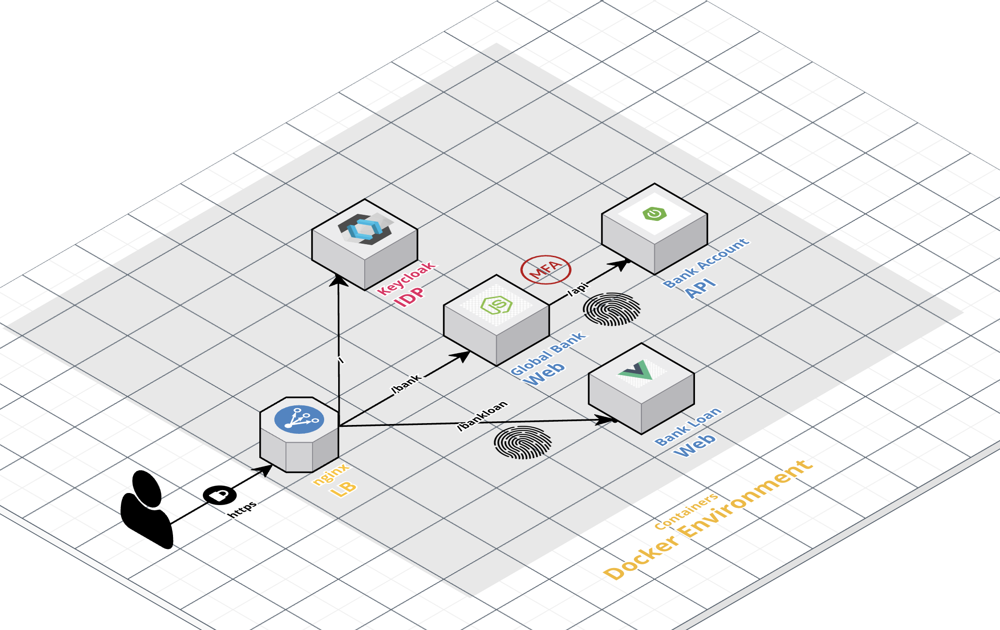 

# How to install?
## Prerequisites

 * Install Git, [Docker](https://www.docker.com/get-docker) and [Docker Compose](https://docs.docker.com/compose/install/#install-compose) in order to run the steps provided in the next section<br>

## Deploy the PoC

1. Clone this repository
    ````bash
    git clone https://github.com/embesozzi/keycloak-workshop-stepup-mfa-biometrics
    cd keycloak-workshop-stepup-mfa-biometrics
    ````

2. Execute following Docker Compose command to start the deployment

   ```sh
   docker-compose -f docker-compose-idp.yml -f docker-compose-apps.yml -f docker-compose-lb.yml up
   ```

3. Access the following URLs below exposed through the NGINX container via a web browser..

| Component                 | URI                        | Username | Password  | Authn or Authz reference|
| ------------------------- | -------------------------- | -------- | --------- | --------- |
| Global Bank Portal        | https://localhost/bank     |          |           | pwd (1F) or pwd + passkeys (MFA) |
| Bank Account API Portal   | https://localhost/api      |          |           | OAuth 2.0 ACR claim loa2  |
| Bank Loan Portal          | https://localhost/bankloan |          |           | passkeys (1F)  |
| Keycloak Console          | https://localhost          | admin    | password  |


4. Optional: If you want to expose the application to the internet, you can use ngrok for testing the passwordless experience with the mobile app. Just run the following command:

    ```bash
    docker run -it -e NGROK_AUTHTOKEN={YOUR-TOKEN} \
        ngrok/ngrok:alpine http host.docker.internal:443
    ```

## Test cases
As an example, I've implemented **Global Bank portal** (Cases 1 and 2) portal that has the following requirements:

* Supports OIDC login with one-factor username and password and two factor with Passkeys
* Only authenticated user with MFA Passkeys can access to manage the bank accounts
* If the user is not authenticated with MFA when managing bank accounts, it triggers the step-up to MFA :) in a lovely way

The **Bank Loan portal** (Case 3) has the following requirements:
* Supports OIDC login with Passkeys
* Only authenticated user with Passkeys can view the loans

### Use case 1: Sign up on the Global Bank Portal

1.1. Access to the [Bank Portal](https://localhost/bank) and proceed with user registration:
    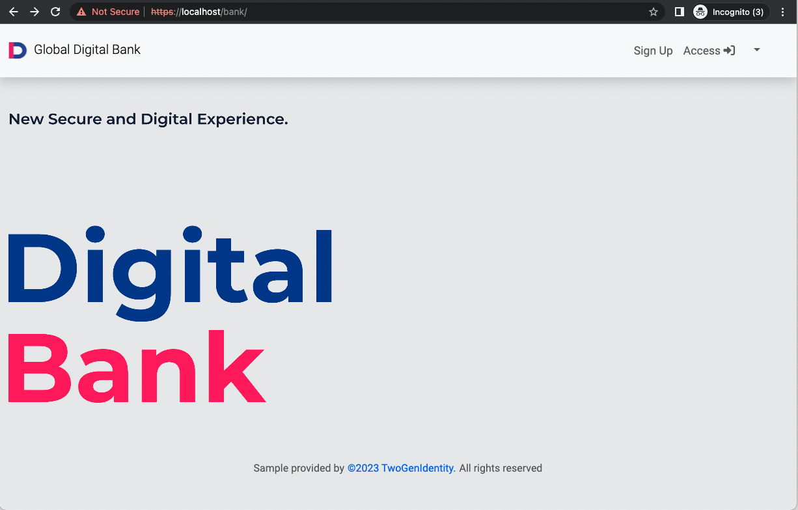
    
1.2. Complete the user information (step 1):   
     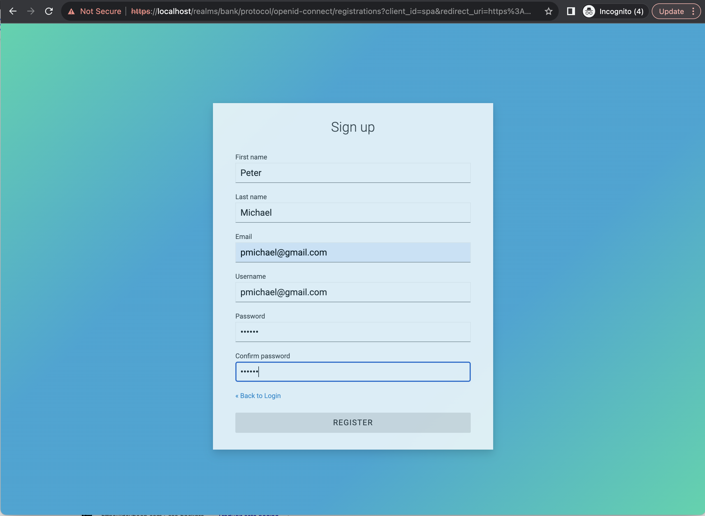
     
1.3. Register the Passkeys (step 2):  
    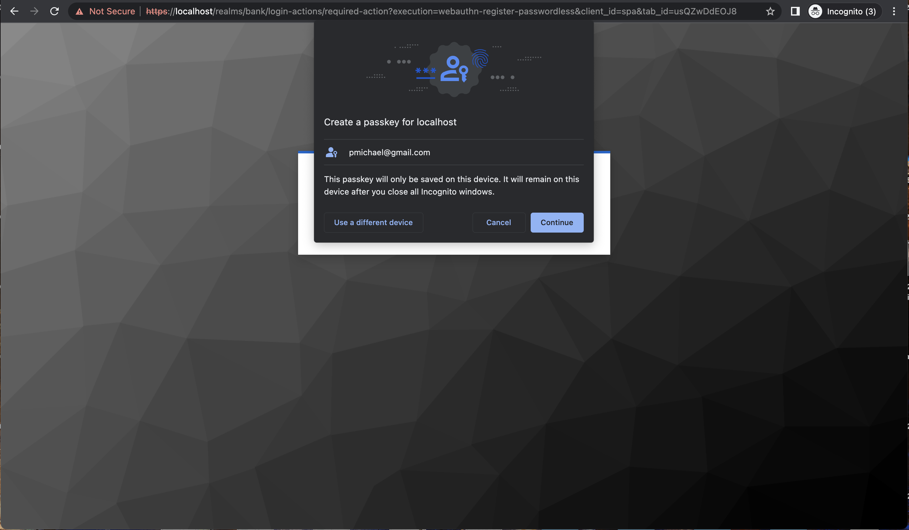
    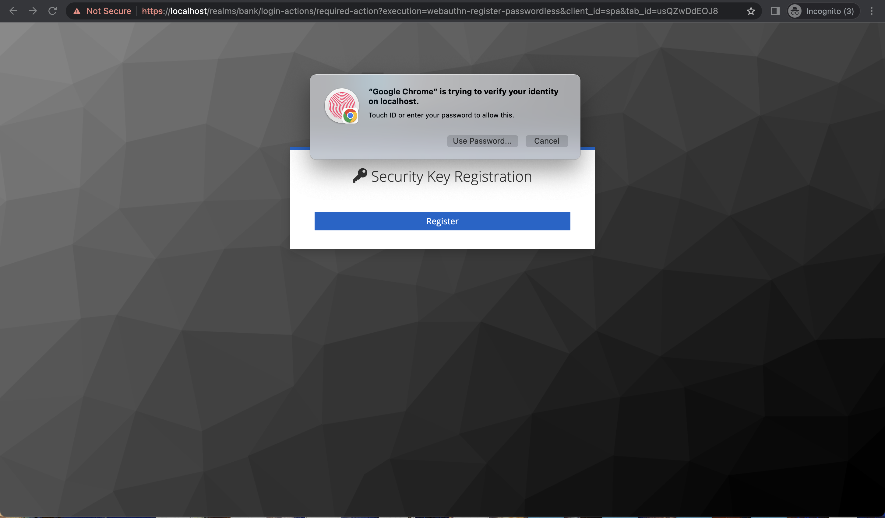

1.4. You will see the Bank Portal Home  
    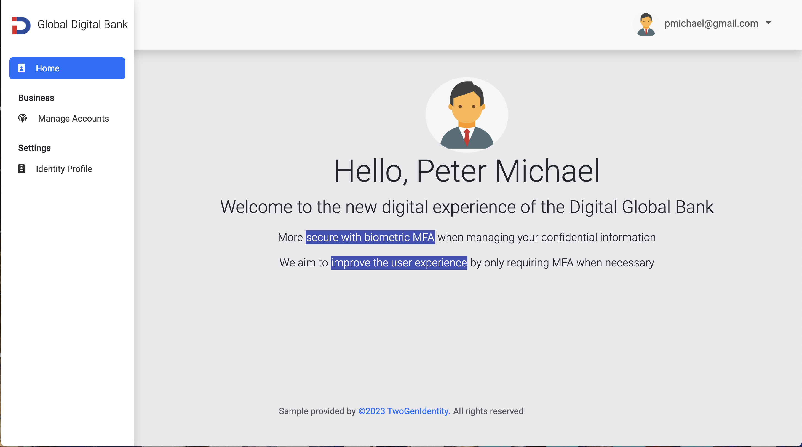

### Use case 2: Sign in to the Global Bank Portal for Managing Bank Accounts

2.1. Access to the [Bank Portal](https://localhost/bank) and Sign In:  
    

2.2 Complete the username and password (1 factor):  
    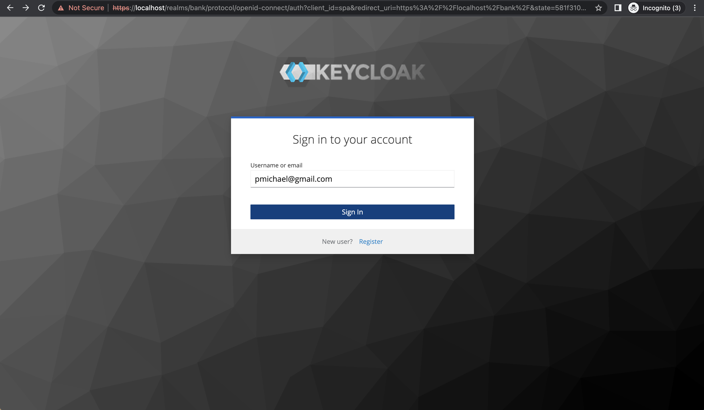
    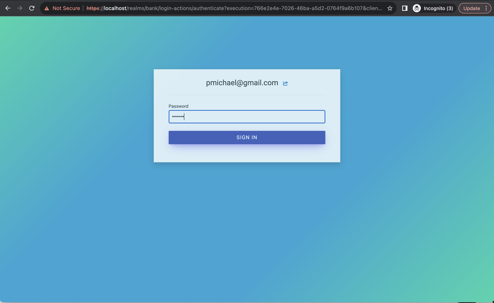  
2.3 You will see to the Bank Portal Home:  
       

2.4 Go to the Identity Profile section and check your ACR claim: **loa1**
     

2.5 Go to the Manage Bank Accounts. You will see that Authn Level is not enough, with a lovely modal that handles the step-up authentication based on the access denied information.   
    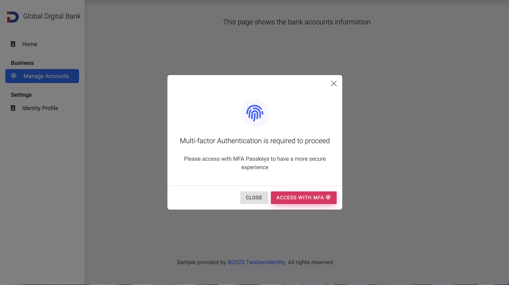 
    
* Proceed to login sign in with MFA

2.6 Complete the user name and password (1 factor):   
    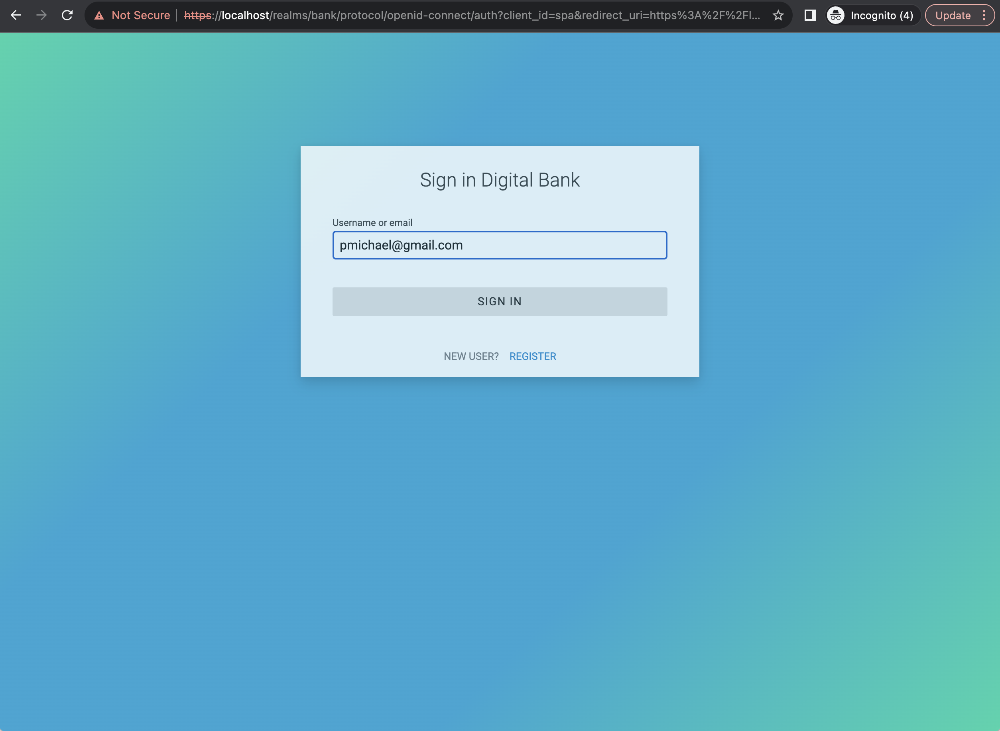
    

2.7 Select your passkey and then verify your identity, in this case with Touch ID (2 factor):   
    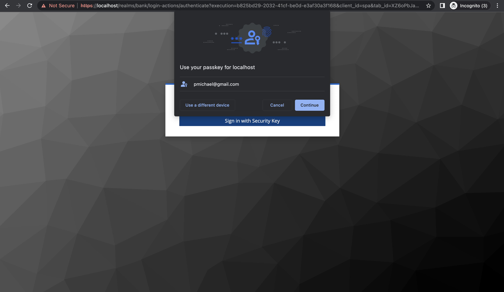
    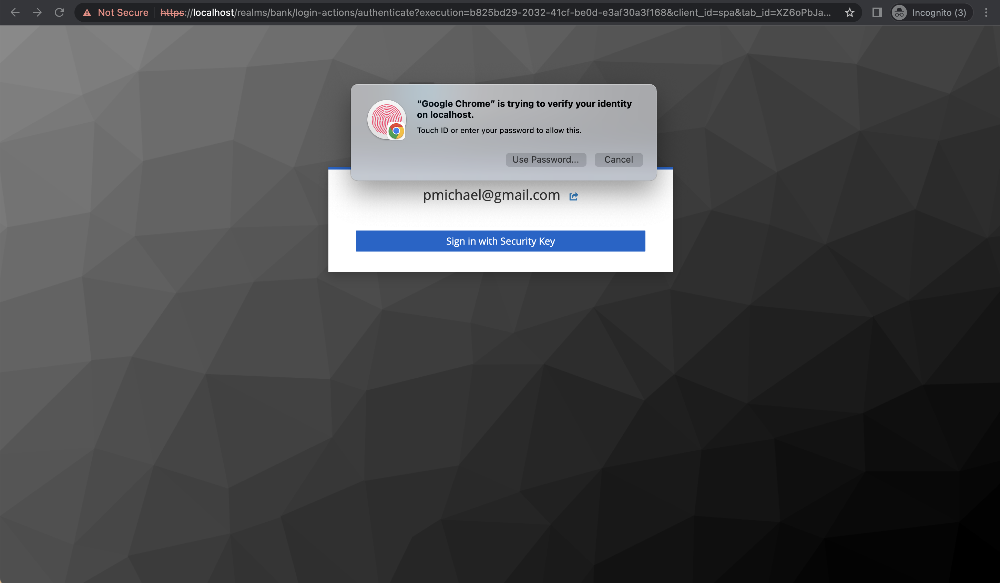

2.8 You will see the Bank Account Information since you have signed in with MFA
    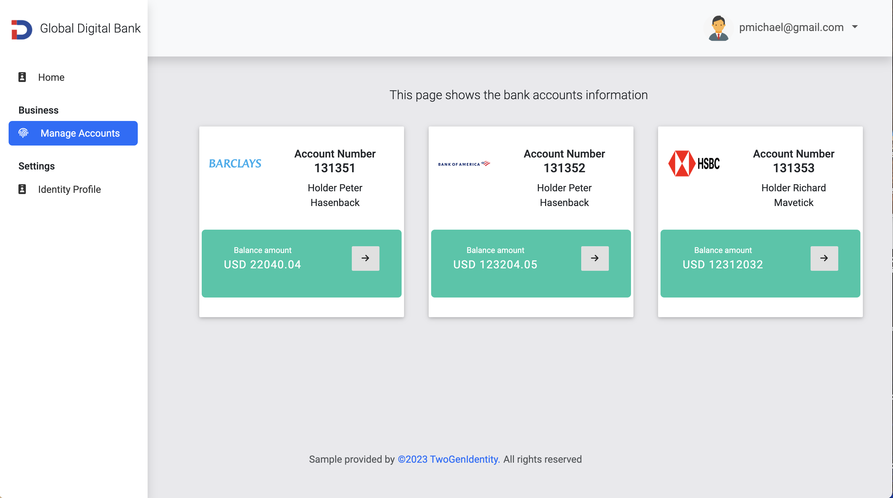

2.9 Go to the Identity Profile section and check your ACR claim: **loa2**
    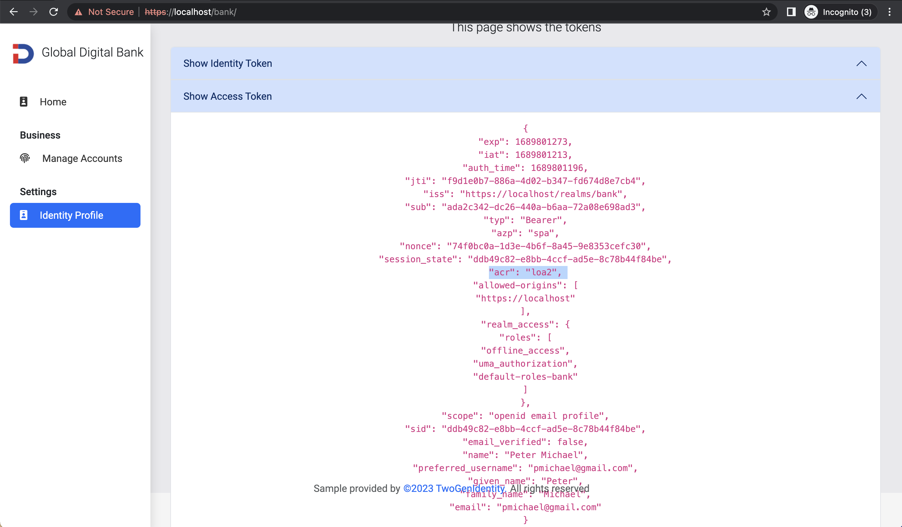 

### Use case 3: Sign in passworless on the Bank Loan Portal

3.1. Access the [Bank Loan Portal](https://localhost/bankloan) and sign in. In this case, I tested the login in a mobile app to verify the user experience (I exposed the app with ngrok):   
    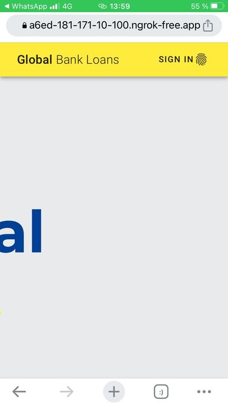

3.2 Click Security key button:   
    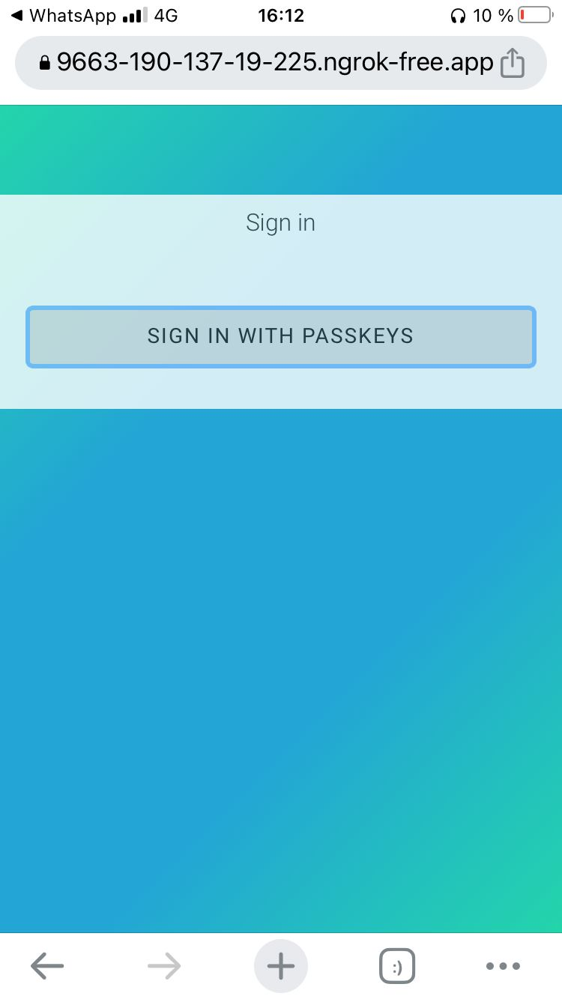

3.3 Verify your identity:      
    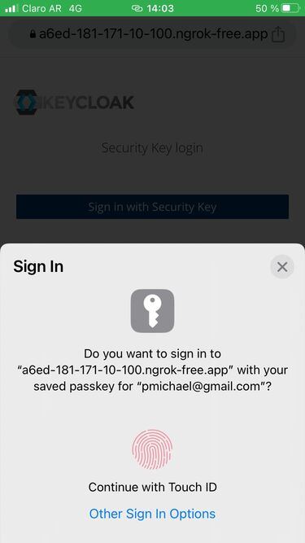

3.4 You will see the Bank Loan portal home:   
    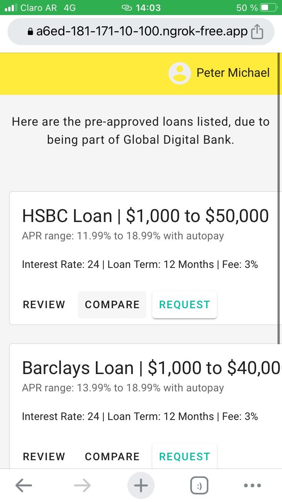
